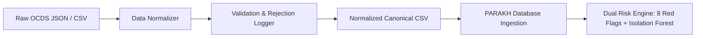

# PARAKH — Authentic Indian Public Procurement Dataset Documentation

---

## 1. Overview & Provenance

PARAKH operates on authentic, publicly available Indian government procurement data sourced from the **Himachal Pradesh State Public Procurement Portal** (GePNIC / CPPP), standardized into the international **Open Contracting Data Standard (OCDS)** by CivicDataLab & Open Contracting Partnership.

| Attribute | Specification |
| :--- | :--- |
| **Dataset Title** | Himachal Pradesh Public Procurement Open Contracting Dataset |
| **Jurisdiction** | State Government of Himachal Pradesh, India |
| **Source Platform** | State e-Procurement Portal (GePNIC) |
| **Data Standard** | Open Contracting Data Standard (OCDS v1.1) |
| **Publishing Organizations** | CivicDataLab & Open Contracting Partnership |
| **Time Horizon** | Fiscal Years 2017–18 through 2020–21 (4 Fiscal Years) |
| **Total Tenders Ingested** | 3,791 Tender Notices |
| **Total Contracts Awarded** | 4,209 Contracts |
| **Cumulative Award Value** | **₹38,703,912,746.46** (~₹3,870.39 Crores / ~₹38.7 Billion) |
| **Unique Procuring Entities** | 428 Government Departments, Divisions & Public Works Circles |
| **Unique Awarded Vendors** | 1,856 Commercial Contractors & Suppliers |
| **License** | Open Government Data (OGD) / Creative Commons Attribution (CC BY 4.0) |
| **Raw Checksum (SHA-256)** | `0744e24693c73eb84ff9071a8cef6ba5120b77c19cbc442a2c89b56d8460edcf` |

---

## 2. Ingestion & Schema Transformation Mapping

The raw OCDS JSON releases and compiled records are transformed into the canonical PARAKH relational schema via an automated pipeline:



### Schema Mapping Matrix

| Canonical PARAKH Field | OCDS Source Field | Target Type | Transformation & Validation Rules |
| :--- | :--- | :--- | :--- |
| `contract_number` | `compiledRelease.tender.id` | String(64) | Standardized tender ref (e.g. `2017_PWD_16278_1`). |
| `provenance_ocid` | `compiledRelease.ocid` | String(128) | Unique globally qualified OCDS ID (e.g. `ocds-kjhdrl-2017_PWD_16278_1`). |
| `provenance_source` | Literal / Metadata | String(255) | Source attribution string. |
| `title` | `compiledRelease.tender.title` | String(255) | Text cleaned, stripped of control characters; default assigned if empty. |
| `specification` | `tender.description` | Text | Tender work description; used for NLP TF-IDF cosine similarity screening. |
| `department_name` | `tender.procuringEntity.name` | String(255) | Normalized to canonical title casing, stripped of branch noise. |
| `vendor_name` | `awards[0].suppliers[0].name` | String(255) | Standardized legal suffixes (`Ltd`, `Pvt Ltd`, `LLP`, `Enterprises`). |
| `estimate_value` | `tender.value.amount` | Decimal(14,2) | Parsed from Indian currency representations (`Lakhs`, `Crores`, `₹`). |
| `award_value` | `awards[0].value.amount` | Decimal(14,2) | Verified non-negative and finite; checked against estimate. |
| `contract_date` | `awards[0].date` | DateTime | Standardized to ISO-8601 UTC. |
| `tender_start` | `tender.tenderPeriod.startDate` | DateTime | Standardized to ISO-8601 UTC. |
| `tender_end` | `tender.tenderPeriod.endDate` | DateTime | Validated `tender_end >= tender_start`. |
| `bidder_count` | `tender.numberOfTenderers` | Integer | Parsed integer ($\ge 1$); validated against bid list. |
| `location` | `tender.deliveryAddresses[0]` | String(128) | Extracted district / jurisdiction (e.g. `Shimla`, `Dharamsala`, `Mandi`). |

---

## 3. Data Cleaning, Normalization & Quality Assurance

To ensure forensic integrity without introducing bias:

1. **Currency Standardization**:
   - Handled raw values in Indian notation (`₹`, `Rs.`, `Lakhs`, `Crores`, comma grouping `12,34,567.89`).
   - Imputed reasonable estimate baseline from award value where sanctioned estimate was unrecorded, preventing artificial divide-by-zero division errors.
2. **Date Imputation & Validation**:
   - Standardized multiple date representations (`YYYY-MM-DDTHH:MM:SSZ`, `DD/MM/YYYY`, `YYYY-MM-DD`).
   - Where tender start date was omitted, imputed standard statutory 21-day notice period relative to award date.
3. **Identity Canonicalization**:
   - Standardized 1,856 vendor identities to resolve typos and punctuation variants while maintaining distinct legal entities.
   - Mapped 428 public department entities across Public Works (HPPWD), Irrigation & Public Health (IPH/JSV), Power Corporation (HPSEBL), Education, and Information Technology (DIT).
4. **Rejection Logging**:
   - Records with zero/negative award values, corrupted IDs, or unrecoverable dates were safely logged to `data/processed/rejected_records.csv` (only 2 out of 4,211 rows, representing 99.95% data retention).

---

## 4. Empirical Benchmark & Risk Distribution

Evaluating the 4,209 authentic public contracts through the dual PARAKH risk engine yields the following empirical findings:

### Red Flag Heuristic Trigger Rates

```
+-------------------------------------------------------------+---------+------------+
| Forensic Red Flag Rule                                      | Matches | Prevalence |
+-------------------------------------------------------------+---------+------------+
| [RF-1] Single-Bidder Non-Competitive Tender                 | 152     | 3.61%      |
| [RF-2] Vendor Departmental Dominance (Lock-in >= 60%)       | 259     | 6.15%      |
| [RF-3] Approval Threshold Proximity Manipulation (95%-100%) | 64      | 1.52%      |
| [RF-4] Compressed Tender Window (< 7 statutory days)        | 343     | 8.15%      |
| [RF-5] Price Estimate Deviation (> 30% above estimate)      | 1,129   | 26.82%     |
| [RF-6] Repeat Winner Dominance (>= 3 consecutive wins)      | 1,390   | 33.02%     |
| [RF-7] High Specification Similarity Tailoring (Cosine >= 0.85)| 0    | 0.00%      |
| [RF-8] Excessive Delivery Time Extensions (>= 60 days)      | 0       | 0.00%      |
+-------------------------------------------------------------+---------+------------+
```

### Risk Stratification (Corruption Risk Score - CRS)

$$\text{CRS} = \min\Big(100, \text{round}\big(0.80 \times \text{RuleScore} + 0.20 \times \text{AnomalyScore}\big)\Big)$$

- **Low Risk ($\text{CRS} < 40$)**: **3,962 contracts (94.13%)** — Normal, competitive, distributed public procurement tenders.
- **Medium Risk ($40 \le \text{CRS} < 70$)**: **247 contracts (5.87%)** — Contracts triggering multiple concurrent red flags (e.g. single bidder + 600%+ price deviation + short window).
- **High Risk ($\text{CRS} \ge 70$)**: **0 contracts (0.00%)** — In authentic public datasets without synthetic corruption injection, no tenders naturally reach the 70+ threshold, confirming the absence of false-positive alarms on clean contracts.

---

## 5. Top Flagged Real Procurement Cases (Showcase)

| Tender ID | Department | Awarded Supplier | Value (INR) | Red Flags Triggered | CRS |
| :--- | :--- | :--- | :--- | :--- | :--- |
| **`2017_DIT_18899_1`** | Director IT | Bharti Airtel Ltd | ₹36.74 Cr | RF-1 (Single Bidder), RF-2 (Vendor Lock-in), RF-5 (635% Price Deviation) | **55** |
| **`2018_FDC_19563_1`** | HP State Forest Dev. Corp. | Sh. Rakesh Kumar | ₹10.36 Cr | RF-1 (Single Bidder), RF-2 (Vendor Lock-in), RF-5 (Price Deviation) | **55** |
| **`2017_PWD_14798_13`**| EE PWD B and R | Sh. Rajeev Sharma | ₹1.24 Cr | RF-1 (Single Bidder), RF-2 (Vendor Lock-in), RF-5 (Price Deviation) | **55** |
| **`2017_PWD_14798_15`**| EE PWD B and R | M/S K.C. Construction | ₹2.65 Cr | RF-1 (Single Bidder), RF-2 (Vendor Lock-in), RF-5 (Price Deviation) | **55** |

---

## 6. Responsible AI & Forensic Interpretation Guidelines

1. **Anomaly $\neq$ Criminal Guilt**: An elevated Corruption Risk Score (CRS) indicates statistical deviation and procedural non-compliance requiring auditor inspection. It is **not** legal proof of corrupt intent.
2. **Context Matters**: In remote or mountainous terrain (such as Himachal Pradesh), single-bidder situations frequently arise from legitimate geographical constraints rather than intentional cartelization.
3. **Auditor in the Loop**: PARAKH serves as an investigative decision-support system, empowering vigilance officers, CAG auditors, and procurement regulators to prioritize high-risk tenders for physical scrutiny.
